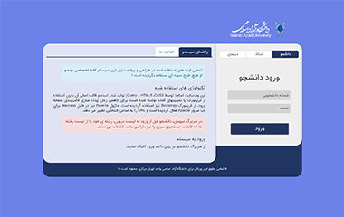
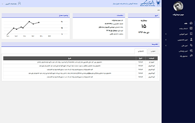
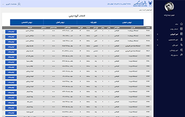
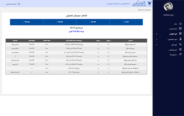
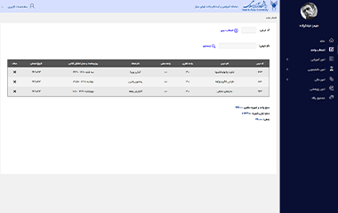
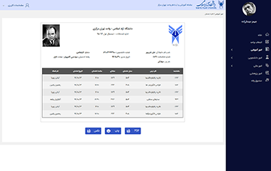
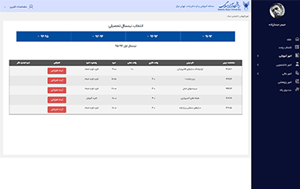

# IAUCTB Student Portal Redesign Screenshots

This project is a redesign of the IAUCTB (Islamic Azad University Central Tehran Branch) student portal, focusing on creating a modern, responsive and user-friendly interface that enhances the overall student experience. Below are screenshots showcasing key sections of the redesigned portal.

---

## Screenshots

### Landing Page

### Home

### Academic Transcript

### Available Courses

### Class Schedule

### Course Enrollment

### Exam Pass

### Grade Appeal

